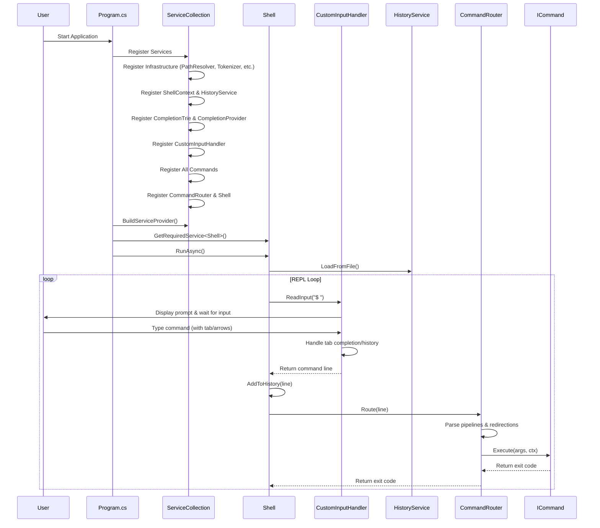
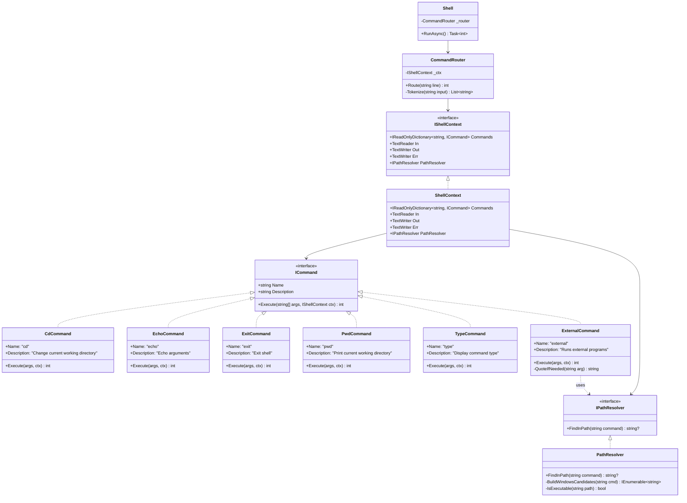
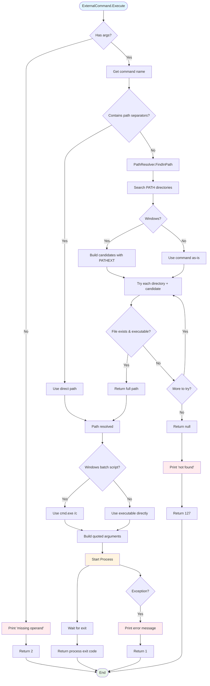
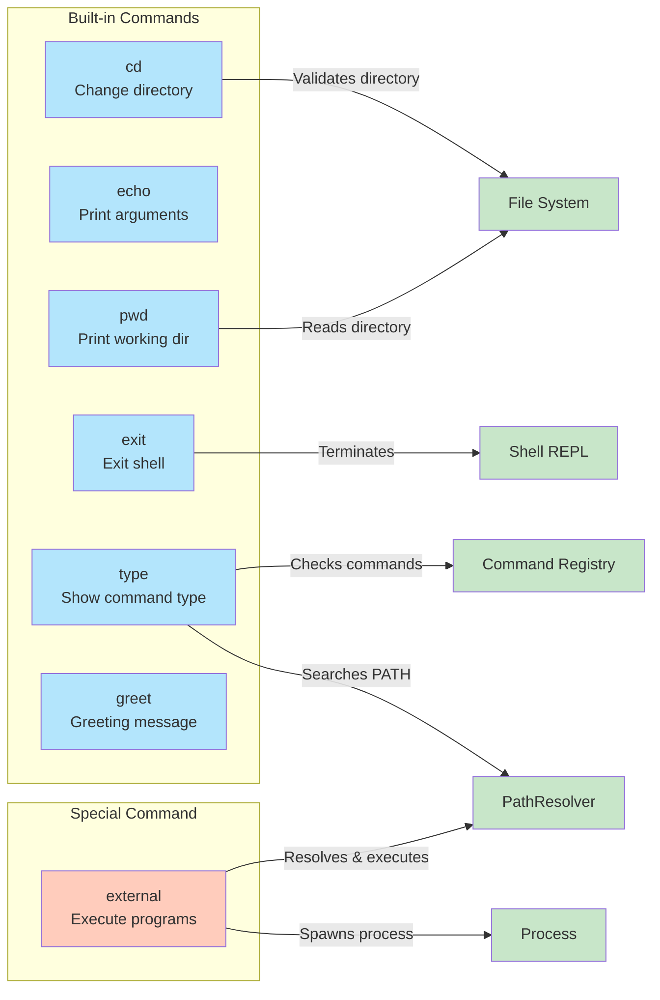
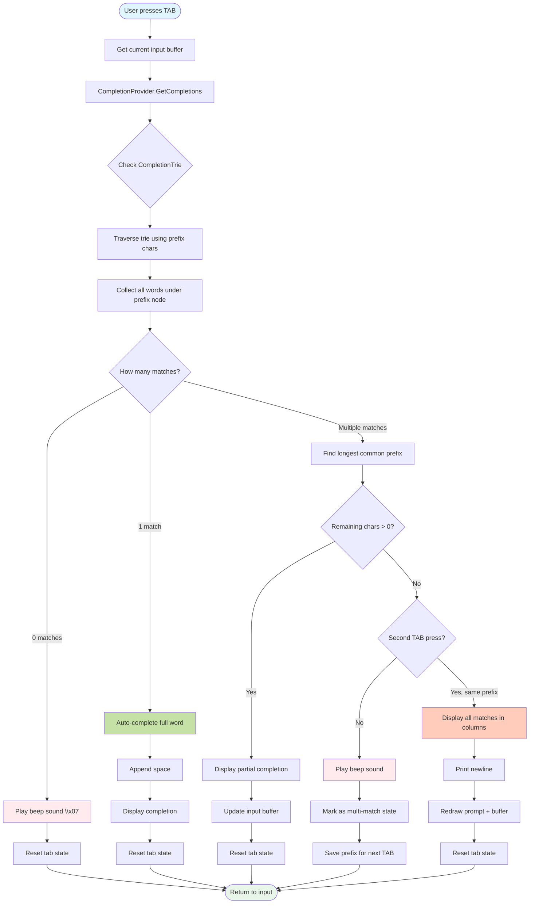
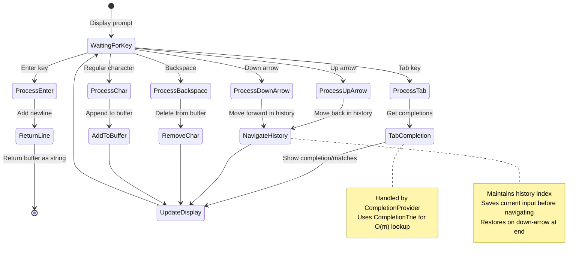
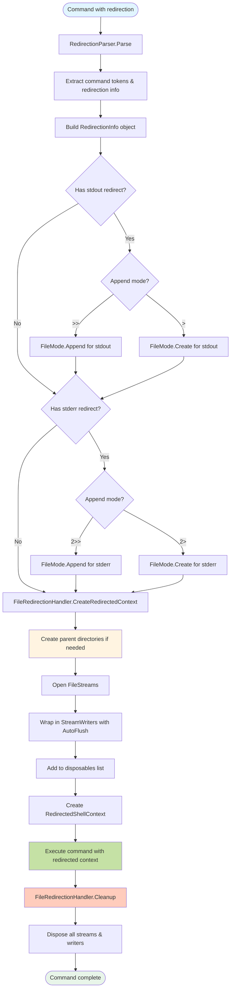

# MiniShell Architecture

This document provides visual diagrams to help understand the structure and flow of the MiniShell project.

## Table of Contents
- [Project Structure](#project-structure)
- [Application Flow](#application-flow)
- [Command Execution Flow](#command-execution-flow)
- [Class Relationships](#class-relationships)
- [External Command Resolution](#external-command-resolution)

---

## Project Structure

```mermaid
graph TD
    A[codecrafters-shell-csharp] --> B[src/]
    A --> T[MiniShell.Tests/]
    B --> C[Program.cs]
    B --> D[Shell/]
    B --> E[Commands/]
    B --> F[Runtime/]
    B --> G[Abstractions/]
    B --> H[Parsing/]
    B --> I[DataStructures/]
    B --> J[Models/]

    D --> D1[Shell.cs]
    D --> D2[CommandRouter.cs]
    D --> D3[PipelineExecutor.cs]

    E --> E1[CdCommand.cs]
    E --> E2[EchoCommand.cs]
    E --> E3[ExitCommand.cs]
    E --> E4[GreetCommand.cs]
    E --> E5[PwdCommand.cs]
    E --> E6[TypeCommand.cs]
    E --> E7[HistoryCommand.cs]
    E --> E8[ExternalCommand.cs]

    F --> F1[ShellContext.cs]
    F --> F2[PathResolver.cs]
    F --> F3[HistoryService.cs]
    F --> F4[CustomInputHandler.cs]
    F --> F5[CommandCompletionProvider.cs]
    F --> F6[FileRedirectionHandler.cs]
    F --> F7[SystemConsole.cs]

    G --> G1[ICommand.cs]
    G --> G2[IShellContext.cs]
    G --> G3[IPathResolver.cs]
    G --> G4[IHistoryService.cs]
    G --> G5[IInputHandler.cs]
    G --> G6[ICompletionProvider.cs]
    G --> G7[IRedirectionHandler.cs]
    G --> G8[ITokenizer.cs]
    G --> G9[IConsole.cs]

    H --> H1[ShellTokenizer.cs]
    H --> H2[PipelineParser.cs]
    H --> H3[RedirectionParser.cs]

    I --> I1[CompletionTrie.cs]

    J --> J1[RedirectionInfo.cs]

    T --> T1[Commands/]
    T --> T2[Runtime/]
    T --> T3[Shell/]
    T --> T4[Parsing/]
    T --> T5[DataStructures/]

    style A fill:#e1f5ff
    style B fill:#fff4e1
    style T fill:#ffe4e1
    style D fill:#e8f5e9
    style E fill:#fce4ec
    style F fill:#f3e5f5
    style G fill:#fff9c4
    style H fill:#e1bee7
    style I fill:#c5e1a5
    style J fill:#ffccbc
```



---

## Application Flow



---

## Command Execution Flow


---

## Class Relationships



---

## External Command Resolution



---

## Built-in Commands Detail



---

## Dependency Injection Setup

```mermaid
flowchart TD
    subgraph Program.cs
        SC[ServiceCollection]
    end

    subgraph Infrastructure
        PR[PathResolver]
        TOK[ShellTokenizer]
        CTX[ShellContext]
        HIST[HistoryService]
    end

    subgraph Tab Completion
        TRIE[CompletionTrie]
        COMP[CommandCompletionProvider]
        INPUT[CustomInputHandler]
    end

    subgraph Commands
        CD[CdCommand]
        ECHO[EchoCommand]
        EXIT[ExitCommand]
        GREET[GreetCommand]
        HISTCMD[HistoryCommand]
        PWD[PwdCommand]
        TYPE[TypeCommand]
        EXT[ExternalCommand]
    end

    subgraph Shell Layer
        RTR[CommandRouter]
        SH[Shell]
    end

    SC -->|Register as Singleton| Infrastructure
    SC -->|Register as Singleton| Tab Completion
    SC -->|Register as Singleton| Commands
    SC -->|Register as Singleton| Shell Layer

    SC -->|Build| SP[ServiceProvider]
    SP -->|Resolve| SH

    SH -->|Inject| RTR
    SH -->|Inject| INPUT
    SH -->|Inject| CTX
    SH -->|Inject| HIST

    RTR -->|Inject| CTX
    INPUT -->|Inject| COMP
    INPUT -->|Inject| CTX
    COMP -->|Inject| TRIE
    COMP -->|Inject| CTX
    HIST -->|Inject| CTX
    CTX -->|Inject| Commands
    CTX -->|Inject| PR

    style SC fill:#e1f5ff
    style SP fill:#fff4e1
    style SH fill:#e8f5e9
    style Infrastructure fill:#c5e1a5
    style Tab Completion fill:#ffccbc
    style Commands fill:#fce4ec
    style Shell Layer fill:#e1bee7
```

---

## Tab Completion Flow



---

## Input Handler State Machine



---

## I/O Redirection Flow



---

## Key Design Patterns

### 1. **Dependency Injection**
All components are registered in the DI container and resolved at runtime, promoting loose coupling and testability.

### 2. **Command Pattern**
Each command implements the `ICommand` interface with a uniform `Execute` method, making it easy to add new commands.

### 3. **Strategy Pattern**
`PathResolver` uses different strategies for Windows vs Unix systems to locate executables.

### 4. **REPL (Read-Eval-Print Loop)**
The `Shell` class implements a continuous loop that reads user input, evaluates commands, and prints results.

### 5. **Router Pattern**
`CommandRouter` acts as a dispatcher, tokenizing input and routing to appropriate command handlers.

---

## Data Flow Summary

1. **User Input** → Shell reads from Console.In
2. **Tokenization** → CommandRouter splits input into command + args
3. **Routing** → Router looks up command in registry
4. **Execution** → Command executes with IShellContext
5. **Output** → Results written to Console.Out/Err
6. **Loop** → Shell continues REPL until exit

This architecture provides clean separation of concerns, making the codebase maintainable and extensible.
