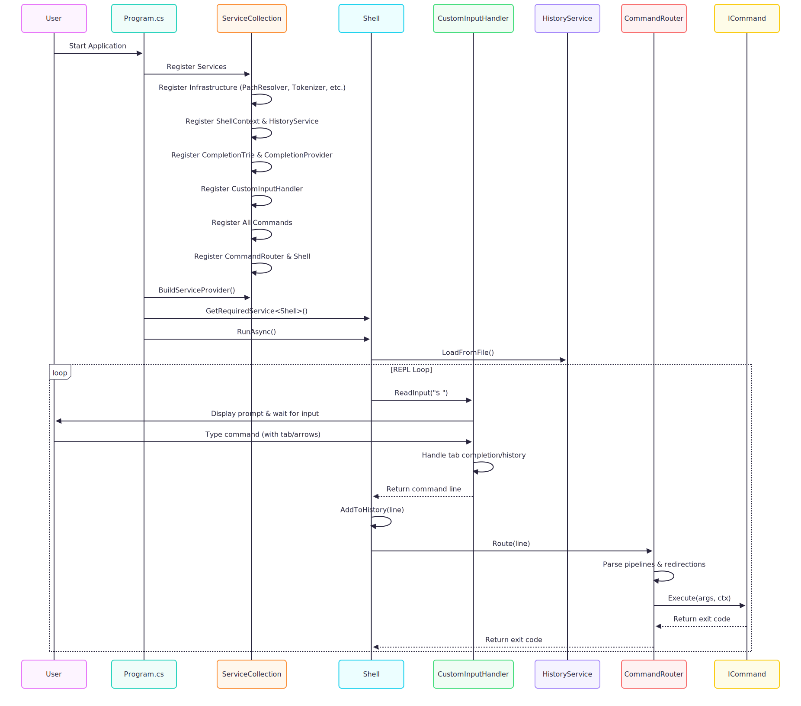

[](https://app.codecrafters.io/users/codecrafters-bot?r=2qF)

# MiniShell - A Modern Shell Implementation in C#

A fully-featured shell built from scratch in C#/.NET, featuring advanced input handling, tab completion with trie-based prefix matching, persistent command history, I/O redirection, and pipeline support.

**📖 [Read the technical deep dive on my blog!](https://diegoparis.com/posts/building-a-shell-in-csharp/)** Learn about the architecture decisions, implementation challenges, and lessons learned while building this shell.

## Key Features

- **Trie-based tab completion** with intelligent prefix matching
- **Full readline-style input** with arrow key navigation and history
- **Persistent command history** with HISTFILE support
- **Cross-platform PATH resolution** for Windows and Unix
- **Dependency injection architecture** for testability
- **I/O redirection** with automatic directory creation

## Supported Features

- **Built-in commands**: `cd`, `pwd`, `echo`, `type`, `exit`, `greet`, `history`
- **Tab completion**: Smart prefix matching with trie data structure
- **Command history**: Persistent history with arrow key navigation
- **I/O redirection**: `>`, `>>`, `2>`, `2>>`
- **Pipelines**: Multi-command pipelines with `|`
- **External commands**: PATH resolution with cross-platform support

## Quick Start

### Prerequisites
- .NET 9.0 SDK

### Running the Shell
```sh
dotnet run
```

Or use the provided script:
```sh
./your_program.sh
```

## Demos

### Tab Completion


### Command History

```sh
$ echo "first command"
$ echo "second command"
# Press UP arrow to navigate through history
$ history
    1  echo "first command"
    2  echo "second command"
$ history -w ~/.minishell_history  # Save history to file
```

### I/O Redirection

```sh
$ echo "hello world" > output.txt
$ echo "line 2" >> output.txt  # Append mode
$ ls /nonexistent 2> errors.txt  # Redirect stderr
$ echo "test" > /tmp/deep/path/file.txt  # Auto-creates directories
```

### Pipelines

```sh
$ echo "hello world" | tr 'a-z' 'A-Z'
HELLO WORLD
$ cat file.txt | grep "pattern" | wc -l
3
```

### Built-in Commands

```sh
$ pwd
/home/user
$ cd /tmp
$ echo hello world
hello world
$ type cd
cd is a shell builtin
$ greet
Hello, World!
```

## Application Flow



[View the detailed mermaid diagram](assets/application-flow-diagram.md)

## Project Structure

```
src/
├── Program.cs                    # DI setup and entry point
├── Shell/
│   ├── Shell.cs                 # REPL orchestrator
│   ├── CommandRouter.cs         # Command parsing and routing
│   └── PipelineExecutor.cs      # Pipeline execution
├── Commands/                     # Built-in command implementations
├── Runtime/
│   ├── CustomInputHandler.cs    # Readline-style input handler
│   ├── HistoryService.cs        # Persistent history
│   ├── PathResolver.cs          # Cross-platform PATH lookup
│   └── FileRedirectionHandler.cs # I/O redirection
├── Parsing/
│   ├── ShellTokenizer.cs        # Input tokenization
│   ├── PipelineParser.cs        # Pipeline parsing
│   └── RedirectionParser.cs     # Redirection parsing
├── DataStructures/
│   └── CompletionTrie.cs        # Tab completion trie
└── Abstractions/                 # Interfaces for testability
```

## Testing

```sh
dotnet test
```

---

Built as part of CodeCrafters ["Build Your Own Shell" Challenge](https://app.codecrafters.io/courses/shell/overview).
