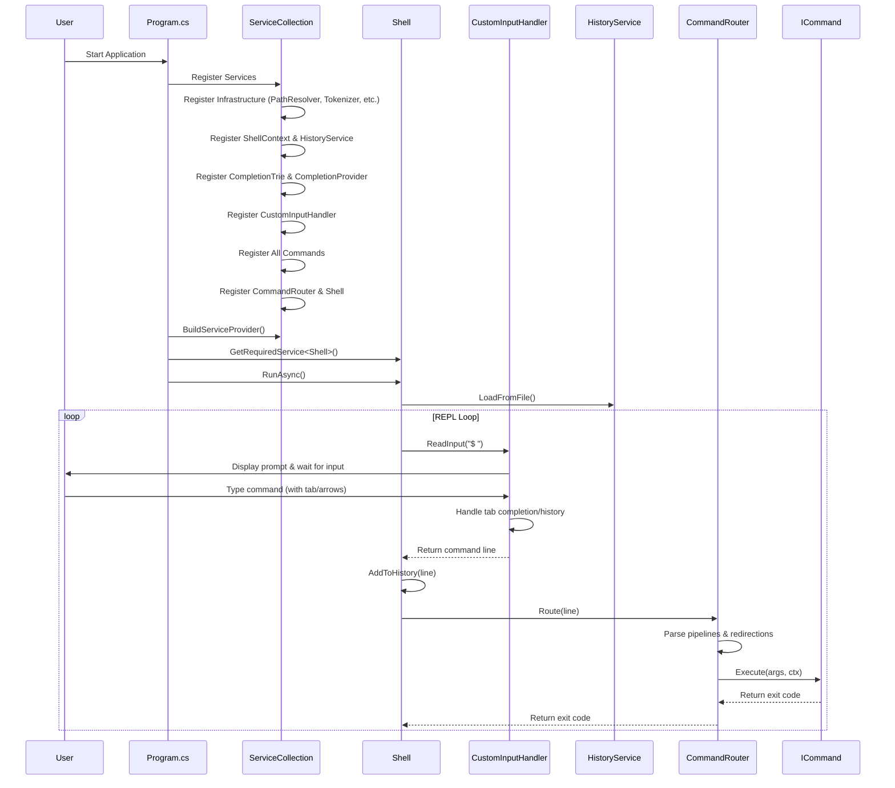

# Application Flow Diagram

This diagram shows the complete application flow from startup to command execution in MiniShell.

```mermaid
sequenceDiagram
    participant User
    participant Main as Program.cs
    participant DI as ServiceCollection
    participant Shell
    participant Input as CustomInputHandler
    participant History as HistoryService
    participant Router as CommandRouter
    participant Cmd as ICommand

    User->>Main: Start Application
    Main->>DI: Register Services
    DI->>DI: Register Infrastructure (PathResolver, Tokenizer, etc.)
    DI->>DI: Register ShellContext & HistoryService
    DI->>DI: Register CompletionTrie & CompletionProvider
    DI->>DI: Register CustomInputHandler
    DI->>DI: Register All Commands
    DI->>DI: Register CommandRouter & Shell
    Main->>DI: BuildServiceProvider()
    Main->>Shell: GetRequiredService<Shell>()
    Main->>Shell: RunAsync()
    Shell->>History: LoadFromFile()

    loop REPL Loop
        Shell->>Input: ReadInput("$ ")
        Input->>User: Display prompt & wait for input
        User->>Input: Type command (with tab/arrows)
        Input->>Input: Handle tab completion/history
        Input-->>Shell: Return command line
        Shell->>Shell: AddToHistory(line)
        Shell->>Router: Route(line)
        Router->>Router: Parse pipelines & redirections
        Router->>Cmd: Execute(args, ctx)
        Cmd-->>Router: Return exit code
        Router-->>Shell: Return exit code
    end
```
